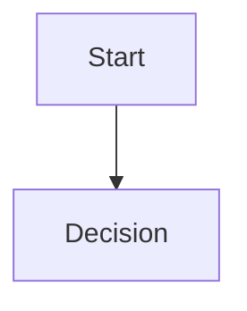

# Diagram

## Purpose

Explain what this diagram communicates and which decision or system it supports.

## Source

- Diagram file:
- Related ADR/RFC:
- Owner:

## Mermaid

## Review Notes

- Scope:
- Assumptions:
- Open questions:
